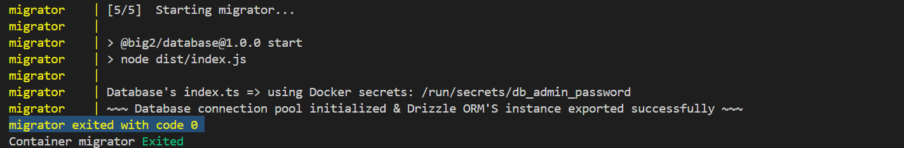
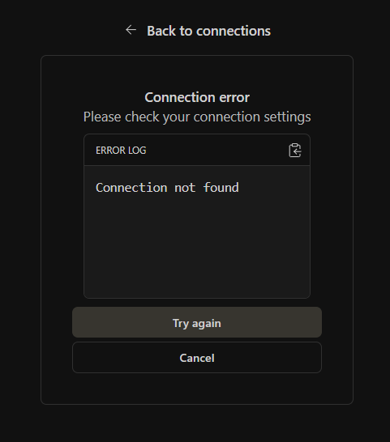
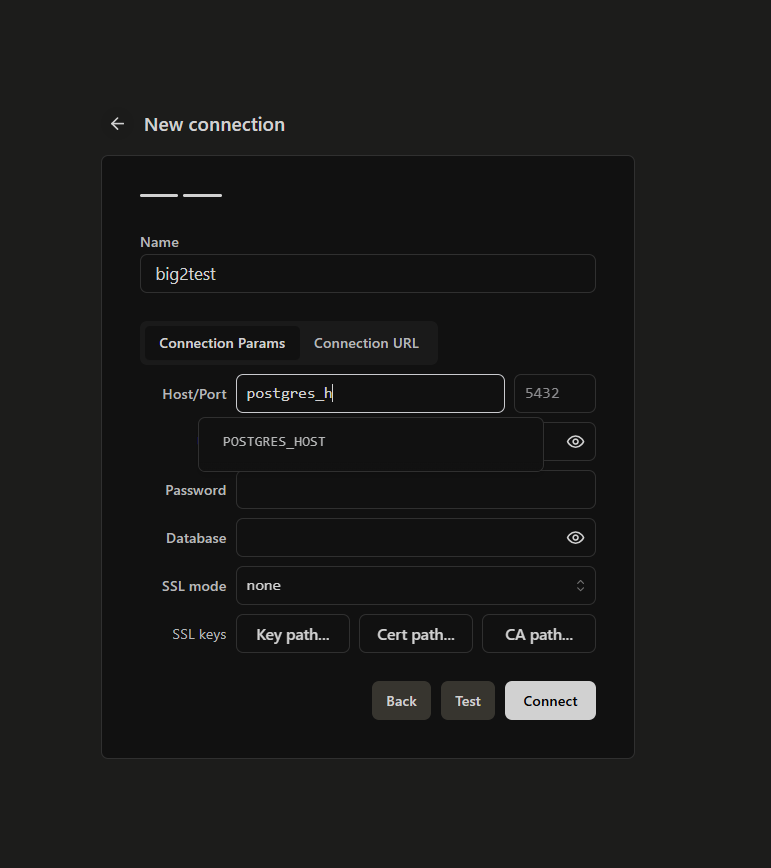
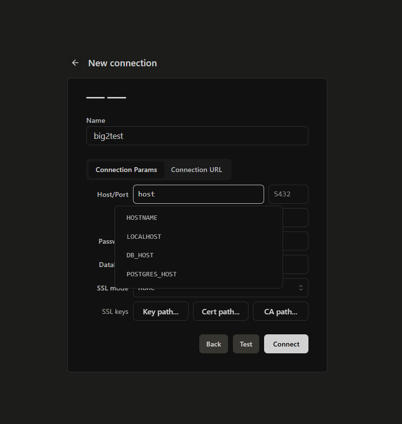
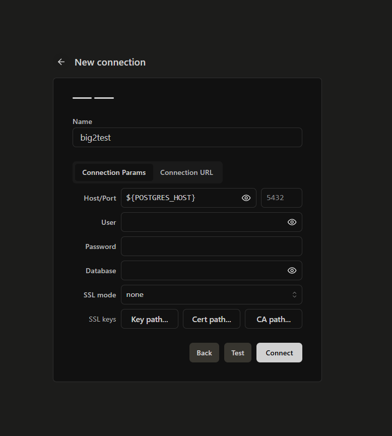
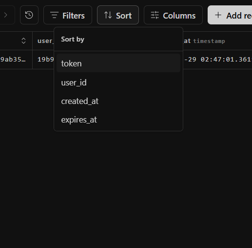
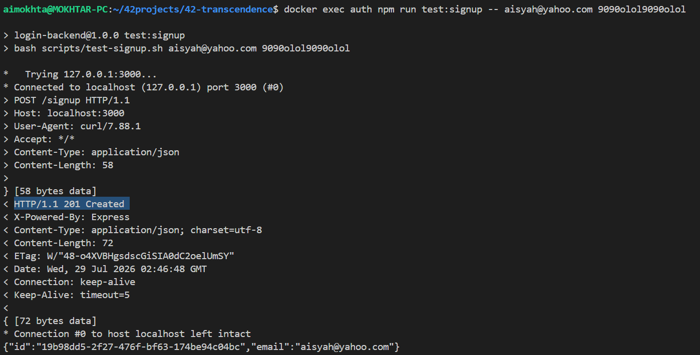
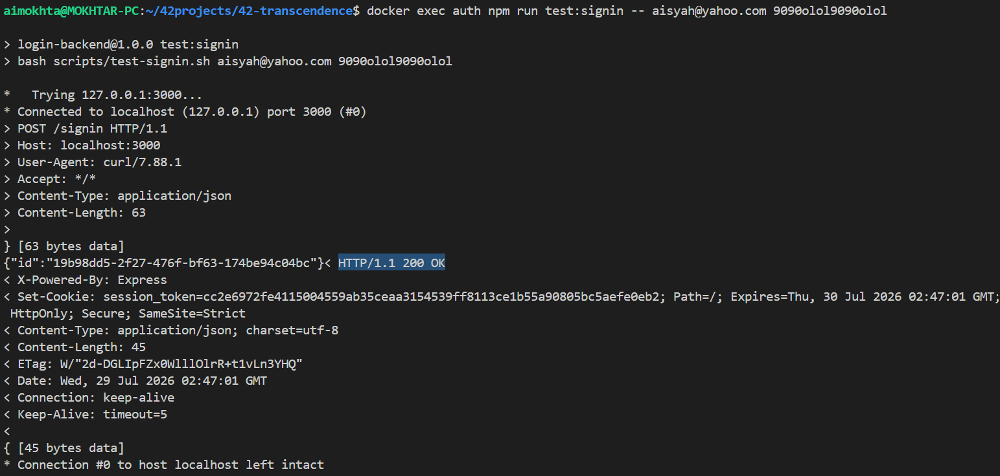

# 🗄️ Database-Centric Development's Setup & Testing Guide (through Drizzle Gateway)

This guide focuses entirely on how to set up your environment, run containers, configure Drizzle Gateway, and execute service tests specifically to observe their direct effects on the database via the dev tool of Data Browser, Drizzle Gateway. Every step is geared toward verifying data persistence and schema updates.

### Index:
* [1. Prerequisites & Required Files](#1-prerequisites--required-files)
* [2. Running Docker](#2-running-docker)
* [3. Opening & Configuring Drizzle Gateway (Database GUI Dev Tool)](#3-opening--configuring-drizzle-gateway-database-gui-dev-tool)
* [4. Live Database Testing: Auth Service](#4-live-database-testing-auth-service)
* [5. Live Database Testing: Party-Manager Service](#5-live-database-testing-party-manager-service)

## 1. Prerequisites & Required Files

Before starting, ensure your database configuration and container secrets are in place at the project root:
(Obtained from the provided GitHub Gist link in the WhatsApp group chat)
* `.env` 
* `secrets/database-passwords/db-admin-password.txt`
* `secrets/drizzle-gateway/dg-masterpass.txt`


## 2. Running Docker

At the project root, start your containers using `make`:

```bash
make
```

> 💡 **Development Note:** Running `make` executes `docker compose up --build` (without the `-d` detached flag) so you can monitor live database initialization logs in real-time.

### Database Readiness Checklist
Look for these specific terminal logs to confirm the database and its migrator have successfully initialized and structured the database, along with other backend microservices:

* **PostgreSQL (The Core DB):**
  

* **Migrator (Schema Builder):**
  

* **Auth Service:**
  

* **Party-Manager Service:**
  

---

## 3. Opening & Configuring Drizzle Gateway (Database GUI Dev Tool)

1. Open your browser and navigate to:
   ```text
   http://localhost:4983
   ```
   <br>

2. **Initial Startup Prompt:** Upon starting up the page (especially after running `make re` or removing previous volumes), you may encounter this prompt below. 👉 **Click Cancel.** <br>
     
   <br><br>

3. **Register a New Database Connection:** Since your volumes are empty, you need to register a new connection. Click **`+ Add database connection`**. <br>
   
   <br><br>

4. **Select Database Engine:** Choose **PostgreSQL**. <br>
   
   <br><br>

5. **Fill in Connection Details:** <br>
   *Most inputs reference your `.env` variables automatically. For example, typing `pgh` or `host` will trigger a dropdown for `PGHOST`—simply click it! No manual copy-pasting required.*
   <br><br>
   | Field | Value to Enter / Select |
   | :--- | :--- |
   | **Name** | Custom name of your choice (e.g., `big2test`) |
   | **Host** | `PGHOST` (select from dropdown) |
   | **Port** | `5432` (leave default) |
   | **User** | `PGUSER` (select from dropdown) |
   | **Password** | Copy & paste manually from `secrets/database-passwords/db-admin-password.txt` *(Tip: Allow your browser to save it for auto-fill next time)* |
   | **Database** | `PGDATABASE` (select from dropdown) |
   | **SSL Mode & SSL Keys** | Leave as default (used for cloud databases) |
   <br>
> ⚠️ **Troubleshooting:** If the browser becomes unresponsive upon clicking **Connect**, simply refresh the tab, repeat from Step 3, and it will work smoothly.<br>
   
   
   
   
   
   <br><br>

6. **Connection Established:** Drizzle Gateway is now connected! By default, it displays the `public` schema. Note that tables are stored inside each service's own dedicated schema, so `public` will appear empty.<br>
   
   <br><br>

7. **Exploring Schemas:** Use the schema dropdown menu to select the specific service schema you want to inspect.<br>
   
   <br><br>

8. **Viewing Tables & Refreshing:** You will see the tables inside each service's schema. Use the **Refresh** button whenever you perform actions that update the database (e.g., new user sign-ups or sign-ins).<br>
     
   
   <br><br>

9. **Filtering & Sorting Data:** When dealing with large datasets, you can easily analyze data using built-in filters and sorting options:<br>
   * **Filter:**
     
   * **Sort:** You can sort across multiple columns sequentially in ascending (`ASC`) or descending (`DESC`) order.
     
     
   <br><br>

---

## 4. Live Database Testing: Auth Service

### Scenario A: New User Sign Up
1. Run the following command at the root terminal:
   ```bash
   docker exec auth npm run test:signup -- <email> <password>
   ```
   *Example:*
   ```bash
   docker exec auth npm run test:signup -- aisyah@gmail.com 0909oioi0909oioi
   ```

2. **Terminal Output:** The auth service will respond with `201 Created`.
3. **Database Verification:** Go to Drizzle Gateway in your browser, navigate to the `user` table under the auth schema, click **Refresh**, and verify the new user record appears.<br>
	
<br><br>

### Scenario B: New User Sign In
1. Run the following command at the root terminal:
   ```bash
   docker exec auth npm run test:signin -- <email> <password>
   ```
   *Note: Use the exact same email and password used during the signup process.*
   *Example:*
   ```bash
   docker exec auth npm run test:signin -- aisyah@gmail.com 0909oioi0909oioi
   ```

2. **Terminal Output:** The auth service will respond with `200 OK`.
3. **Database Verification:** Go to Drizzle Gateway in your browser, navigate to the `session` table under the auth schema, click **Refresh**, and verify the session record has been created.<br>
	
<br><br>

## UPDATED! new ways to test authentication now: <br>
### signup:
```
bash services/authentication/scripts/test:signup.sh <user's email> <user's password>
```
### signin:
```
bash services/authentication/scripts/test:signin.sh <user's email> <user's password>
```
### validate:
```
bash services/authentication/scripts/test:validate.sh <user's session_token>
```
### logout:
```
bash services/authentication/scripts/test:logout.sh <user's session_token>
```

<!-- 
## 5. Live Database Testing: Party-Manager Service

`Note: Test this only after successfully tested authentication's signin`

### Scenario A: Checking player is Online/Offline
1. Save the test file anywhere in your host: `services/party-manager/test/test.html`
2. Double click on the file for it to open up on browser
3. Fill in:<br>
Server URL = http://localhost<br>
Socket.IO path = /socket/party<br>
Session token = (copied from session_token generated by test:sigin via terminal or in session table via Drizzle-Gateway)<br>

4. Click Connect
5. In Drizzle-Gateway, go to party-manager-schema schema -> player_status table -> the said token marked as `TRUE` within is_online column, indicating player is **online**<br>
6. Go back to the test.html page again, click Disconnect, then go back to the same player_status table via Drizzle-Gateway, click refresh, the said token marked as `FALSE` within is_online column, indicating player is **offline**.
-->

## 5. Live Database Testing: Party-Manager Service

`**Prerequisite:** Perform this test only after successfully verifying authentication via test:signin`


### **Scenario A: Player Online/Offline Status Verification**


<div style="background-color: #071422; border-left: 4px solid #0066cc; padding: 12px; border-radius: 4px;">
  <strong>1. Setup Test Client 🛠️</strong><br>
   > Locate the test file at `services/party-manager/test/test.html`.<br>
   > Save the file into your host.<br>
   > Open it in your web browser by double-click `test.html` in your host's library
</div>
<div style="background-color: #0d133d; border-left: 4px solid #0066cc; padding: 12px; border-radius: 4px;">
  <strong>2. Connection Configuration ⚙️</strong><br>
   Fill in the test form with the following details:
   
   | Configuration Field | Value / Instructions |
   | :--- | :--- |
   | **Server URL** | `http://localhost` |
   | **Socket.IO Path** | `/socket/party` |
   | **Session Token** | `session_token` (generated from `test:signin`'s terminal output or `session` table in Drizzle-Gateway) |
</div>
<div style="background-color: #1d053a; border-left: 4px solid #0066cc; padding: 12px; border-radius: 4px;">
  <strong>3. Execution & Verification Steps 🧪</strong><br>
   
   ##### 🟢 Step A: Test Online State
   1. Click **Connect** on the browser test page.
   2. Open **Drizzle-Gateway** and navigate to: `schema:party-manager-schema -> table:player_status`
   3. Locate the visual table record matching your `session_token`.
   4. **Expected Result:** The said session_token within `is_online` column is set to `TRUE` 🟢.

   ##### 🔴 Step B: Test Offline State
   1. Return to browser test page and click **Disconnect**.
   2. Refresh the `player_status` table in **Drizzle-Gateway**.
   3. **Expected Result:**  The said session_token within `is_online` column is set to `FALSE` 🔴
</div>
